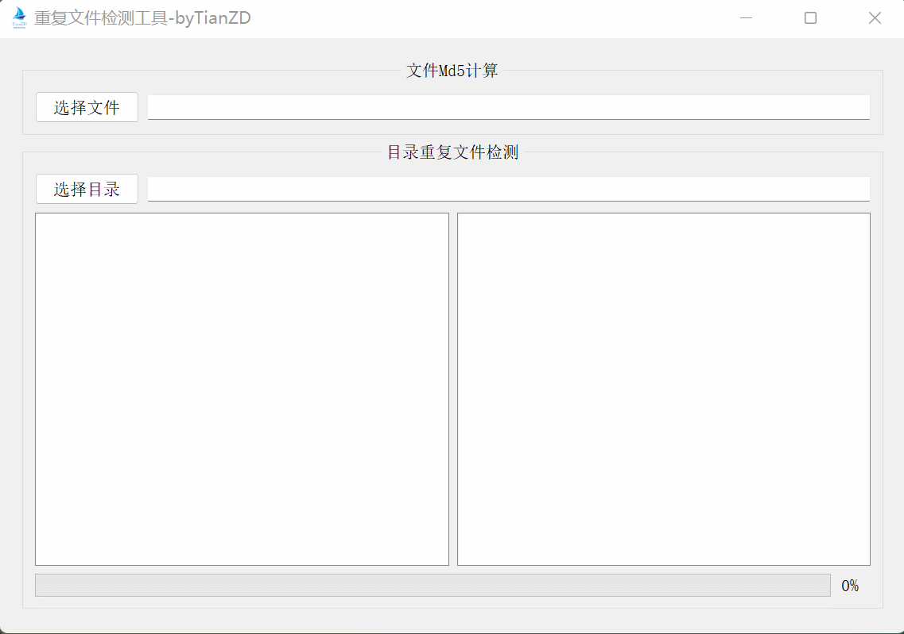

# 重复文件检测工具

## 环境
- Clion 2022.1.2
- qt 5.14.2

## 功能
- 单个文件计算md5
- 文件夹内重复文件检测

## 下载
### windows
[windowsRelease-v1.0.2](https://github.com/tianzhendong/duplicateFilesCheck/releases/download/v1.0.2/duplicateFilesCheckv1.0.2.zip)

[windowsRelease-v1.0.3](https://github.com/tianzhendong/duplicateFilesCheck/releases/download/v1.0.3/windowsRelease-v1.0.3.zip)

## 更新记录
### 20220619 v1.0.2
- [x] 增加打开文件目录功能
- [x] 增加删除文件功能

### 20220620 v1.0.3
- [x] 修改UI
