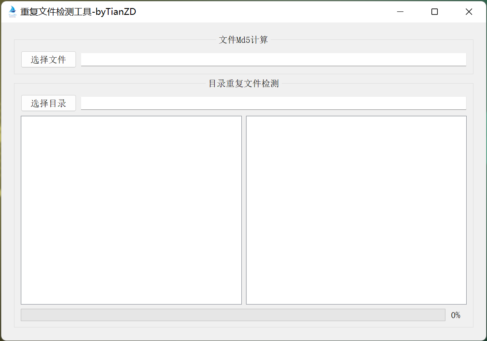
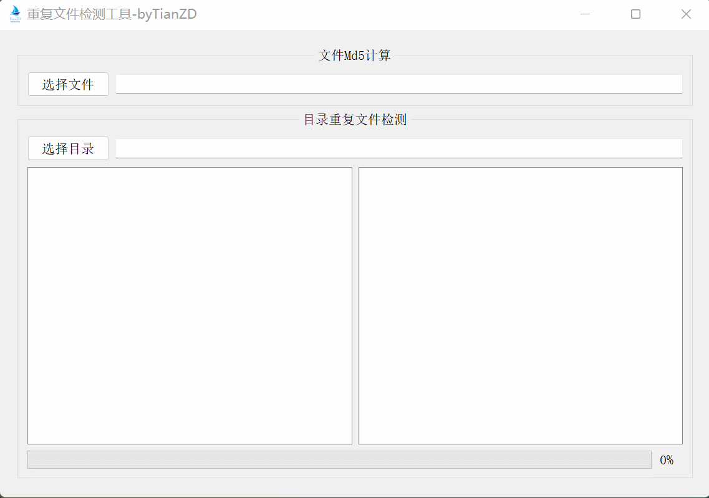

# 重复文件检测工具
## demo




## 环境
- Clion 2022.1.2
- qt 5.14.2

## 功能
- 单个文件计算md5
- 文件夹内重复文件检测

## 使用
### windows release下载
[windowsRelease-v1.0.2](https://github.com/tianzhendong/duplicateFilesCheck/releases/download/v1.0.2/duplicateFilesCheckv1.0.2.zip)

[windowsRelease-v1.0.3](https://github.com/tianzhendong/duplicateFilesCheck/releases/download/v1.0.3/windowsRelease-v1.0.3.zip)

### Linux编译

下载源码
```bash
git clone git@github.com:tianzhendong/duplicateFilesCheck.git

cd duplicateFilesCheck
```

修改qt路径
```bash
vim CMakeLists.txt
```
将qt路径修改为对应的目录
```CMakeLists
# 设置
set(CMAKE_PREFIX_PATH "/home/tian/Qt5.12.9/5.12.9/gcc_64")
```
编译&运行
```bash
mkdir build
cd build
cmake ..
make
./DuplicateFilesCheck
```

## 更新记录
### 20220619 v1.0.2
- [x] 增加打开文件目录功能
- [x] 增加删除文件功能

### 20220620 v1.0.3
- [x] 修改UI

### 20220714 
- [x] 修改文档
